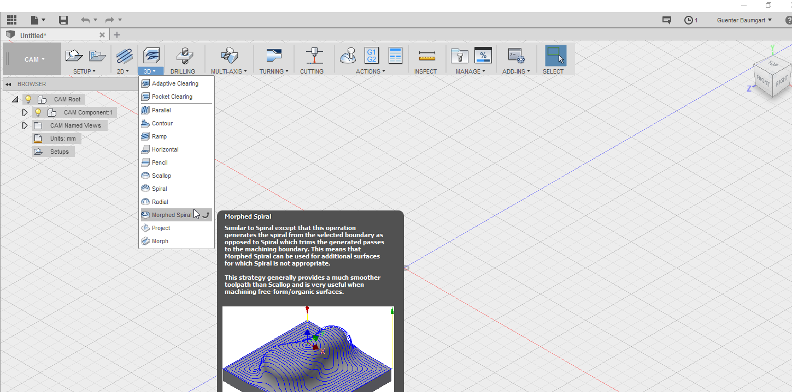

# Control-Freak IDE v3 - Renderers

CF3-IDE will have multiple renderers: Web & Terminal (CLI)

# Web - UI

Given the last 4 years of experience, we can simplify & unclutter the interface. As mentioned in the [overview](../Control-Freak-v3.md), Control-Freak is a 'vertical' or more precise a composition of loose 'components' with defaults and pre-defined layout definitions. A privileged user is free to modify these settings and save it as new 'vertical' in his new catalog of 'solutions'

# Terminal - UI

just as the web-interface just for the CLI.

# Key components

## Command (aka actions) - Renderers

### Toolbars

As in CF2, we render commands in global(top-menu), local toolbars and context-menus. Each toolbar can be modified by the user. The modification can be done globally or per context.

### Context - Menu

As in CF2 but we will allow more sophisticated widgets in context menus (New).

### Ribbon - Toolbar (New)

- we will make the 'Ribbon' toolbar as default and provide a toggle between 'small' and 'large' icons (classic ribbon).

'Large' Icons: . Attention, this is only a prototype. The ribbon renderer will be rewritten from scratch and should look more like this : 

- commands might provide a description or preview inline in most 'action renderers' as seen above.

- recent commands will be placed as well in each command renderer.

### Command palette (New)

We will adopt widely used 'Command Palettes' :

or here a more advanced version which allows to place his preferred 'commands' to the palette it self:

